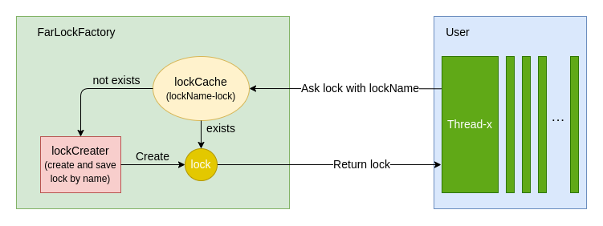

# 通用分布式锁组件

### 简介
该项目是基于java实现的分布式锁组件，分别基于redis、zookeeper、MySQL实现了分布式锁功能

---

### 使用方法
1. 通过`FarlockFactory.getLockFactory()`或spring自动注入方法，获取锁工厂；
2. 通过`lockFactory.getLock("lockName")`获取指定名称的锁；
3. 通过`lock.lock()/lock.lock(timeout)`和`lock.unlock()`方法加锁和解锁

---

### 模块
#### 1. farlock-common
*farlock基础工具*
- config: 配置相关包，包括spring-boot配置和自定义配置
- consts: 常量包，包括字符串常量和默认配置常量
- exceptions: 错误类包
- pool: 连接池包，包括各种分布式存储工具的连接池工厂
- utils: 工具类包

#### 2. farlock-core
*farlock核心，依赖farlock-common*
- factory: 工厂类包，包含`FarlockFactory`(锁工厂)，用于生产并存储分布式锁
- locks: 锁类包，包含锁接口以及基于不同工具的实现
- utils: 工具类包

#### 3. farlock-spring-boot-starter
*spring-boot的farlock插件，依赖farlock-core，用来实现spring-boot集成*

#### 4. farlock-sample和farlock-spring-boot-starter-sample
*farlock使用例程*

---

### 架构
#### 基于Redis
1. 锁获取过程

2. 锁结构
待补充
#### 基于Zookeeper
待补充

#### 基于MySQL
待补充